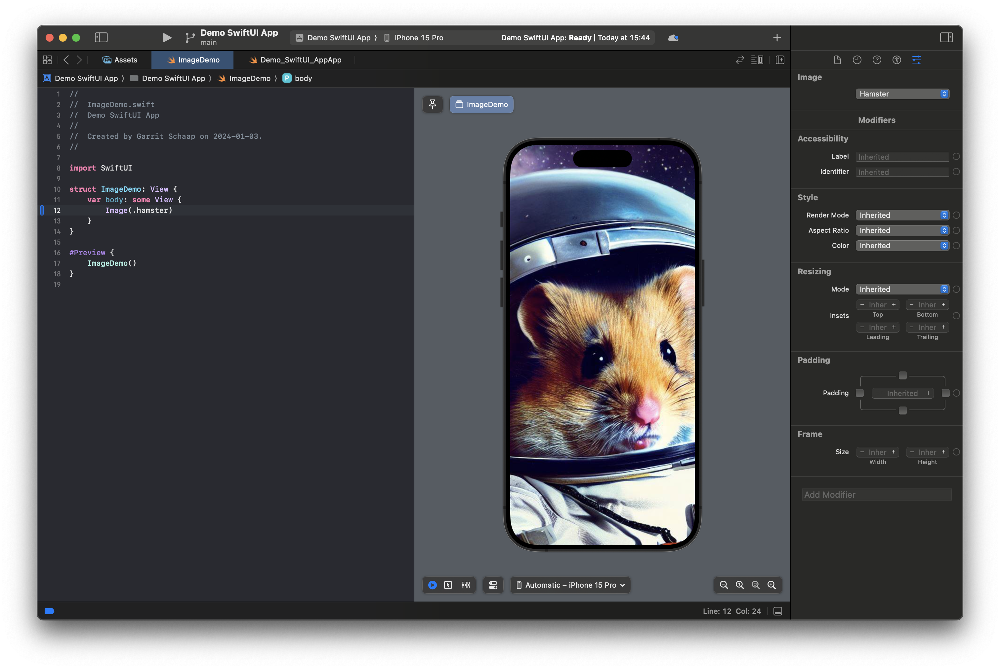
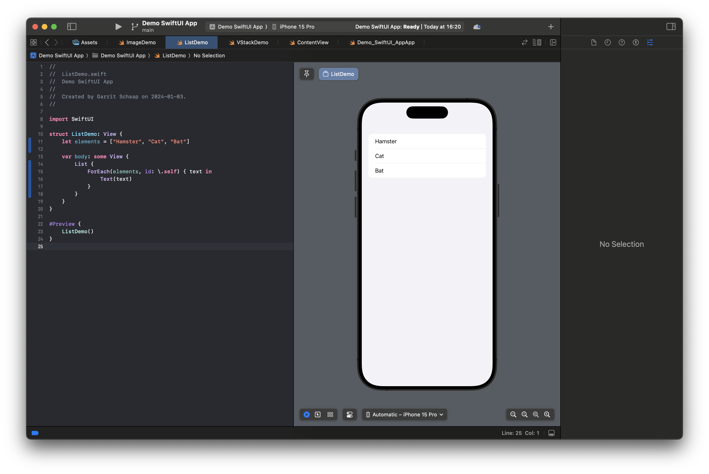
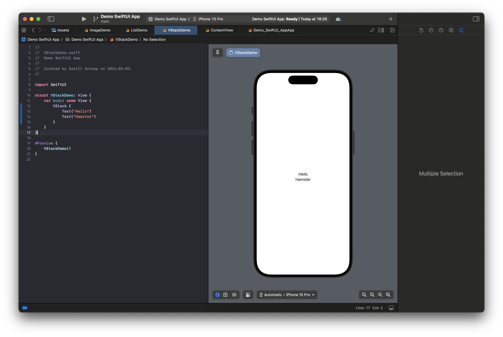
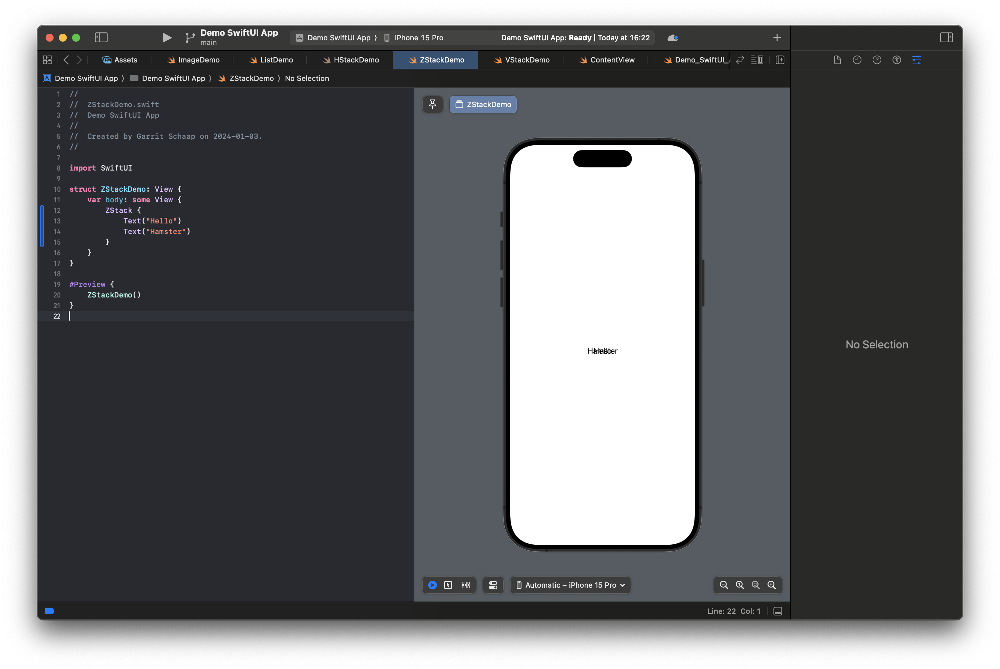

# SwiftUI Elements

We can use different elements in SwiftUI to design our views.

## Elements for displaying

### Text

The text element can display a `String` to the user.

```Swift
Text("Hello World!")
```

### Image

The image element can display either an image from your assets, or an icon using SF Symbols. To add an image to your assets, you open the asset catalogue in Xcode, click on the plus and create a new _Image Set_. Now you can give the image asset a name. Next, you can add images in the 3 different resolution (1x, 2x, 3x). That means, if your image should be `200px` by `200px` on the screen, you should have another image with the double (400x400) and another one with the triple resolution (600x600). This is used to display the image in the resolution that the device of the user supports. On the right side you can also select _Single Scale_ to upload a single resultion. The name will be converted into an `enum` value that you can use. In my example, I named the image `Hamster` and can use the enum value `.hamster` to access it.

```Swift
Image(.hamster)
```



As you can see, it fills out the whole screen. We will see in a moment how we can use _modifiers_ to change that.

But besides images, you can also use [SF Symbols](https://developer.apple.com/sf-symbols/). SF Symbols is a large icon library, maintained by Apple with over 5000 icons. You can use these icons for free and they even come with animations.

To use a SF Symbol icon in your code, you use the Image element with the `systemName` parameter as an initializer.

```Swift
Image(systemName: "swift")
```

### Label

A label consists of a text and an image, most likely an icon. You often use SF Symbols here. It can be used inside a button for example. Depending on the context, SwiftUI will choose to display the text, the icon, or both.

```Swift
Label("Edit", image: "pencil")
```

### AsyncImage

With `AsyncImage` you can display an image that is loaded from the internet. It takes a `URL` object as a paremeter, which you can initialize with a `String` for example.

```Swift
AsyncImage(url: URL(string: "https://cataas.com/cat"))
```

Now that we have covered some basic elements, lets move on to a bit more complex layouts.

## Elements for layouting

In SwiftUI, you have a lot of different layouting views. In this part, we will cover the most common ones.

### List

As you have seen earlier, you can create a list with different elements.

```Swift
List {
    Text("Hello")
    Text("World")
}
```

But how about a list with dynamic elements from an array? No problem. We first have to define our array, outside of the body of the `View` and we can then use the `ForEach` to create a `Text` element for every element in our list. Because `String` is not `Identifiable`, we need to define an `id` for every element in our array. We have different possibilities. In our example, we used `\.self` that defines that the elements value is used. We need to identify the created views for SwiftUI, so it can handle transitions, if the list is updated for example.

```Swift
struct ListDemo: View {
    let elements = ["Hamster", "Cat", "Bat"]

    var body: some View {
        List {
            ForEach(elements, id: \.self) {
                Text($0)
            }
        }
    }
}
```

Notice that we use `$0` to access the parameter, instead, we could also have created a named parameter, like in this example:

```Swift
struct ListDemo: View {
    let elements = ["Hamster", "Cat", "Bat"]

    var body: some View {
        List {
            ForEach(elements, id: \.self) { text in
                Text(text)
            }
        }
    }
}
```



### VStack

A `VStack` is used to vertically stack elements on top of each other.

```Swift
VStack {
    Text("Hello")
    Text("Hamster")
}
```



### HStack

A `HStack` is similar to a `VStack` but stacks elements horizontally instead.

```Swift
HStack {
    Text("Hello")
    Text("Hamster")
}
```


### ZStack

A `ZStack` stacks elements on top of each other, on the z-axis. Not the most useful example, I know 🙃.

```Swift
ZStack {
    Text("Hello")
    Text("Hamster")
}
```



Next, we will see what we can do with _modifiers_.
