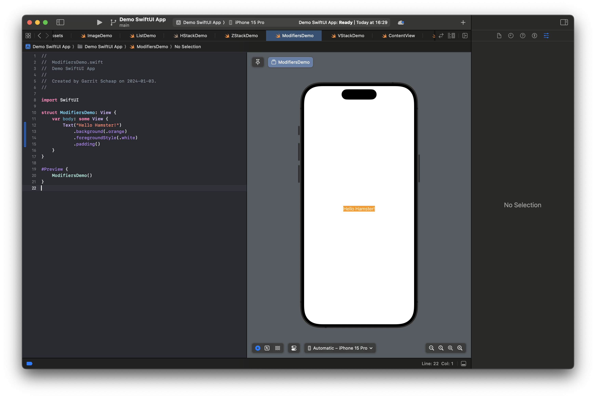
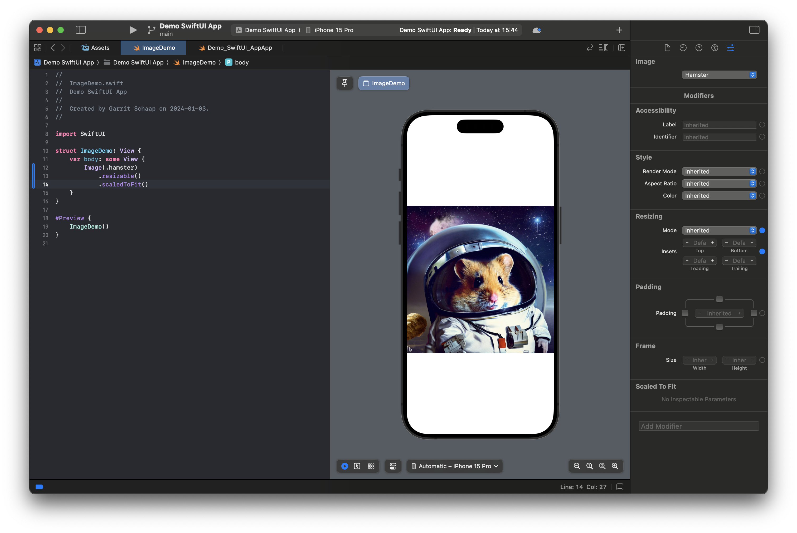
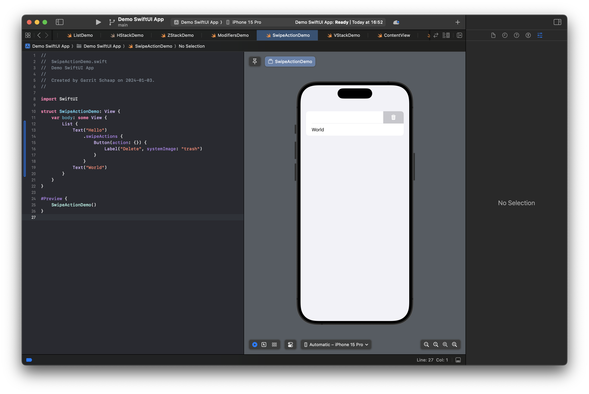

# Modifiers

Modifiers are used in SwiftUI to modify the look and behavior of SwiftUI elements. They can be used to add _padding_ around an element, set a _background color_ of an element, change the _font_ that is used in a `Text` element, or can be used to _resize_ an `Image`. We will have a look at the most common ones.

Modifiers bubble down the view tree... (WRITE MORE HERE)

Please keep in mind that the position of the modifier can make a large difference how it modifies your views.

## General modifiers

Background (color, behind)
Overlay
Padding
Frame

```Swift
Text("Hello Hamster!")
    .background(.orange)
```


```Swift
Text("Hello Hamster!")
    .foreground(.red)
```


```Swift
Text("Hello Hamster!")
    .background(.orange)
    .foregroundStyle(.white)
```


```Swift
Text("Hello Hamster!")
    .padding()
    .background(.orange)
    .foregroundStyle(.white)
```


## The order of the modifier is important

```Swift
Text("Hello Hamster!")
    .background(.orange)
    .foregroundStyle(.white)
    .padding()
```



## Modifiers for texts

```Swift
Text("Hello Hamster!")
    .font(.largeTitle)
    .italic()
    .bold()
```


## Modifiers for images

If you remember our example from earlier with the hamster in space. The image was covering the whole screen. If we want to make an image fit into the screen, we first have to make it `.resizable()` and then we can for example use `.scaledToFit()` to make sure, that it will not be larger than our screen.

```Swift
Image(.hamster)
    .resizable()
    .scaledToFit()
```



You see in this example that we have to use two modifiers in a specific order, to get the desired result.

## Control modifiers

```Swift
List {
    Text("Hello")
        .swipeActions {
            Button(action: {}) {
                Label("Delete", systemImage: "trash")
            }
        }
    Text("World")
}
```




Now you are ready to learn about State in SwiftUI.
