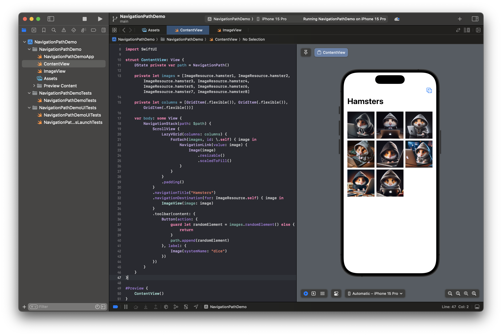
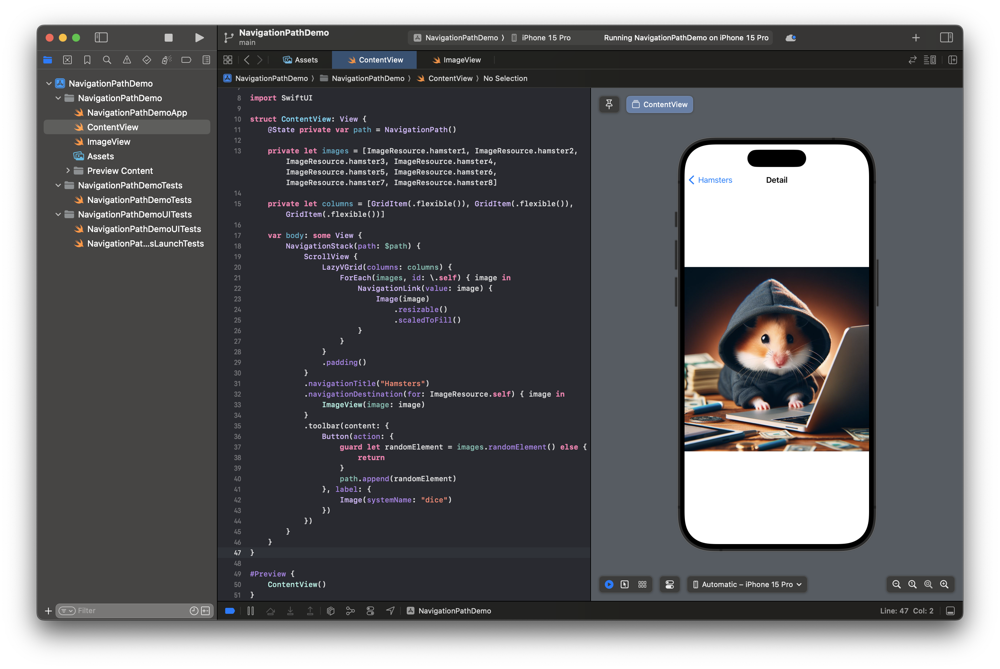

# NavigationPath

If you want to have more control over the navigation and want to be able to programmatically change the navigation, for example pop a screen or navigate to a random one, we will have to use `NavigationPath`. We will use the previous example of the photo gallery and add a button to randomly navigate to an image.

First, we have to create a state property to store our `NavigationPath`.

```Swift
@State private var path = NavigationPath()
```

Next, we need to add the `path` variable to the `NavigationStack`. Notice that we need to bind it.

```Swift
NavigationStack(path: $path)
```

And lastly, we need to add a button to the `NavigationBar` to randomly select an element and navigate to it. Notice that we use a `guard` statement to unwrap the optional value and make sure that we actually have an image to navigate to. The `NavigationPath` is a so-called _type-eraser_, that means it can store any `Hashable` type and an `ImageResource` is different to an `Optional<ImageResource>` type. Therefore, we need to make sure that we send in an `ImageResource`.

```Swift
.toolbar(content: {
    Button(action: {
        guard let randomElement = images.randomElement() else {
            return
        }
        path.append(randomElement)
    }, label: {
        Image(systemName: "dice")
    })
})
```

Here is the full code:

```Swift
@State private var path = NavigationPath()

private let images = [ImageResource.hamster1, ImageResource.hamster2, ImageResource.hamster3, ImageResource.hamster4, ImageResource.hamster5, ImageResource.hamster6, ImageResource.hamster7, ImageResource.hamster8]

private let columns = [GridItem(.flexible()), GridItem(.flexible()), GridItem(.flexible())]

var body: some View {
    NavigationStack(path: $path) {
        ScrollView {
            LazyVGrid(columns: columns) {
                ForEach(images, id: \.self) { image in
                    NavigationLink(value: image) {
                        Image(image)
                            .resizable()
                            .scaledToFill()
                    }
                }
            }
            .padding()
        }
        .navigationTitle("Hamsters")
        .navigationDestination(for: ImageResource.self) { image in
            ImageView(image: image)
        }
        .toolbar(content: {
            Button(action: {
                guard let randomElement = images.randomElement() else {
                    return
                }
                path.append(randomElement)
            }, label: {
                Image(systemName: "dice")
            })
        })
    }
}
```




[Here](https://www.hackingwithswift.com/books/ios-swiftui/navigating-to-different-data-types-using-navigationpath) you can find another tutorial about `NavigationPath`.

After you learned a lot about Navigation in SwiftUI, we can check out animations.
