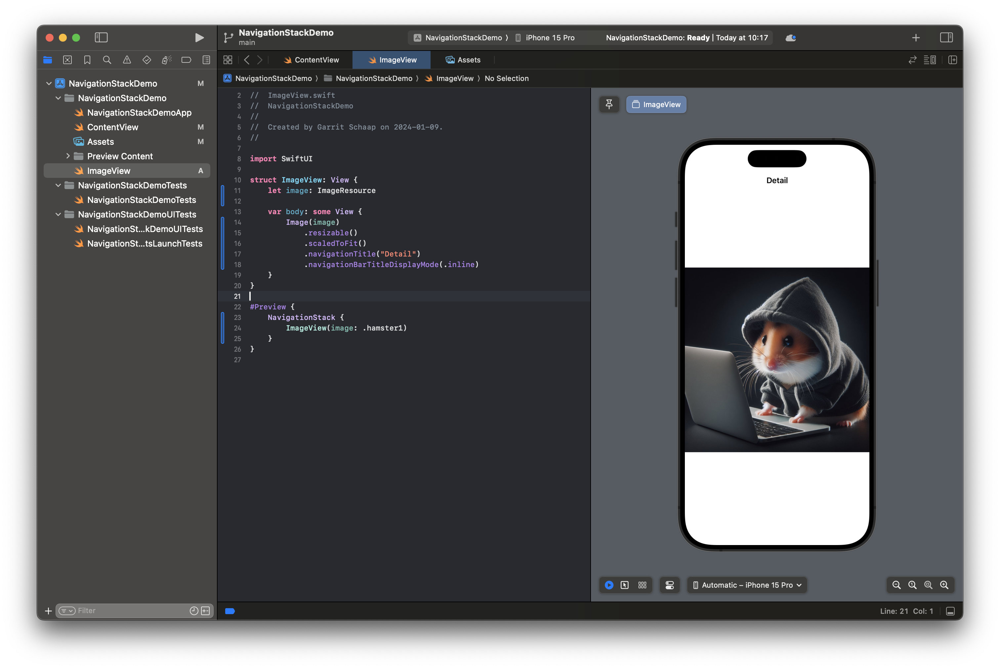
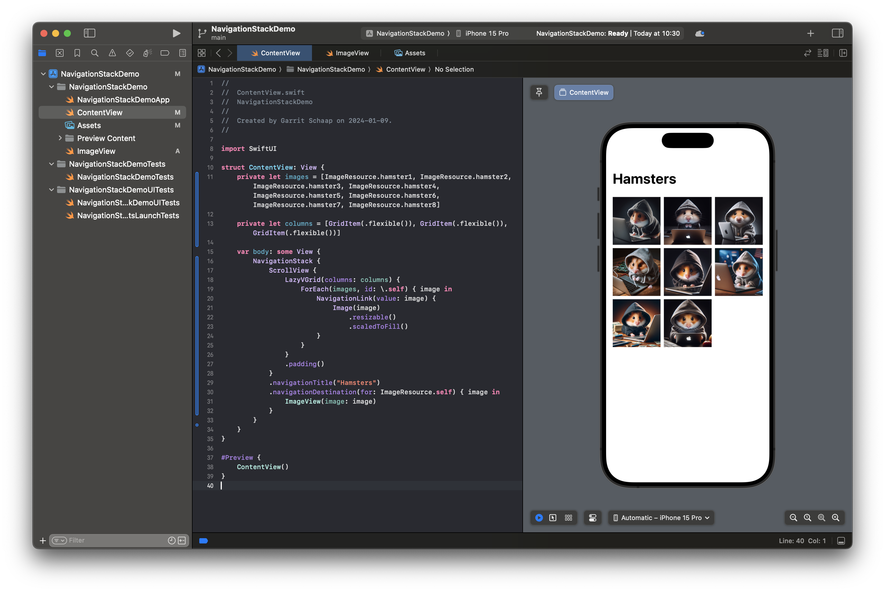
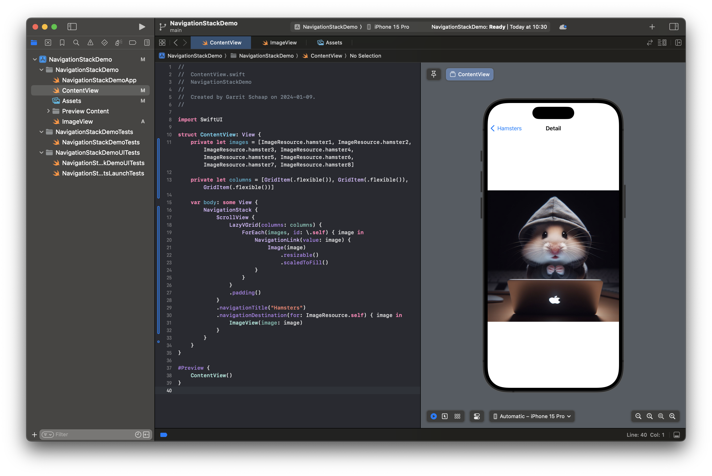

# NavigationStack

With a `NavigationStack` you can build a hierarchical navigation. This is a very common pattern in mobile apps. With a hierarchical navigation you can navigate deeper, look at details, for example, a specific band on Spotify or a channel on YouTube.

For our example, we will build a photo gallery app. After adding some example images to the `Assets` we can start creating our app.

We start with the `ImageView`, which will be our detail view that will display the image. We create a view that expects an `ImageResource` as a parameter and will display it. Besides the `resizable` and the `scaledToFit` modifier that we already know, you can notice two more. We are using the `navigationTitle` modifier to set the text that is displayed in the `NavigationBar` and the `navigationBarTitleDisplayMode` modifier to define how the `NavigationBar` should look. The default value here is `.automatic`. But we want to make sure that the bar is always displayed in `.inline` mode. The other option is `.large`.

```Swift
struct ImageView: View {
    let image: ImageResource

    var body: some View {
        Image(image)
            .resizable()
            .scaledToFit()
            .navigationTitle("Detail")
            .navigationBarTitleDisplayMode(.inline)
    }
}

#Preview {
    NavigationStack {
        ImageView(image: .hamster1)
    }
}
```



As you can notice, we wrapped the `ImageView` in the preview in a `NavigationStack`. This way, we can see the `NavigationBar` also in preview.

Now, let's have a look at the `ContentView`. At the beginning, we define the array with our images. Next, we define the amount of columns that we want to display our images. We define them, because we will use a `LazyVGrid`, that means a vertial grid that supports lazy-loading. If we add more `GridItem`s to the array, we will add more columns. Right now, we want to have 3 colums that have a `.flexible` width. If you want to learn more about lazy grids, you can do that [here](https://www.hackingwithswift.com/quick-start/swiftui/how-to-position-views-in-a-grid-using-lazyvgrid-and-lazyhgrid).

Inside the `body` we first create a `NavigationStack`. That is our container in charge of handling the navigation, animating the transitions, displaying the `NavigationBar`, etc. You usually have one `NavigationStack` per navigation. If you use the `TabView`, you might have one per view inside the `TabView`. Inside, we create a `ScrollView` to support scrolling up and down, and inside of it the `LazyVGrid`. In the lazy grid we use the `ForEach` that we already know from `List` to loop through all images. For every image we create a `NavigationLink`. That is the element that is responsible for triggering a navigation event. As `value` we set the single `image` and we use the `Image` element to display it to the user.

Whenever we click a `NavigationLink`, it will look for a `navigationDestination` modifier that takes the same type, in our case an `ImageResource`. We define the navigation destination further down. Whatever code is in the code block will be executed when we navigate to this specific element.

```Swift
private let images = [ImageResource.hamster1, ImageResource.hamster2, ImageResource.hamster3, ImageResource.hamster4, ImageResource.hamster5, ImageResource.hamster6, ImageResource.hamster7, ImageResource.hamster8]

private let columns = [GridItem(.flexible()), GridItem(.flexible()), GridItem(.flexible())]

var body: some View {
    NavigationStack {
        ScrollView {
            LazyVGrid(columns: columns) {
                ForEach(images, id: \.self) { image in
                    NavigationLink(value: image) {
                        Image(image)
                            .resizable()
                            .scaledToFill()
                    }
                }
            }
            .padding()
        }
        .navigationTitle("Hamsters")
        .navigationDestination(for: ImageResource.self) { image in
            ImageView(image: image)
        }
    }
}
```




If you want to find out more about different types of grids in SwiftUI, you can check out [this article](https://medium.com/@jakir/various-kind-of-grid-views-in-swiftui-a-comprehensive-guide-5650511937a0).

There are also programmatically ways to navigate and have more controls over the navigation. Let's have a look at the `NavigationPath`.
