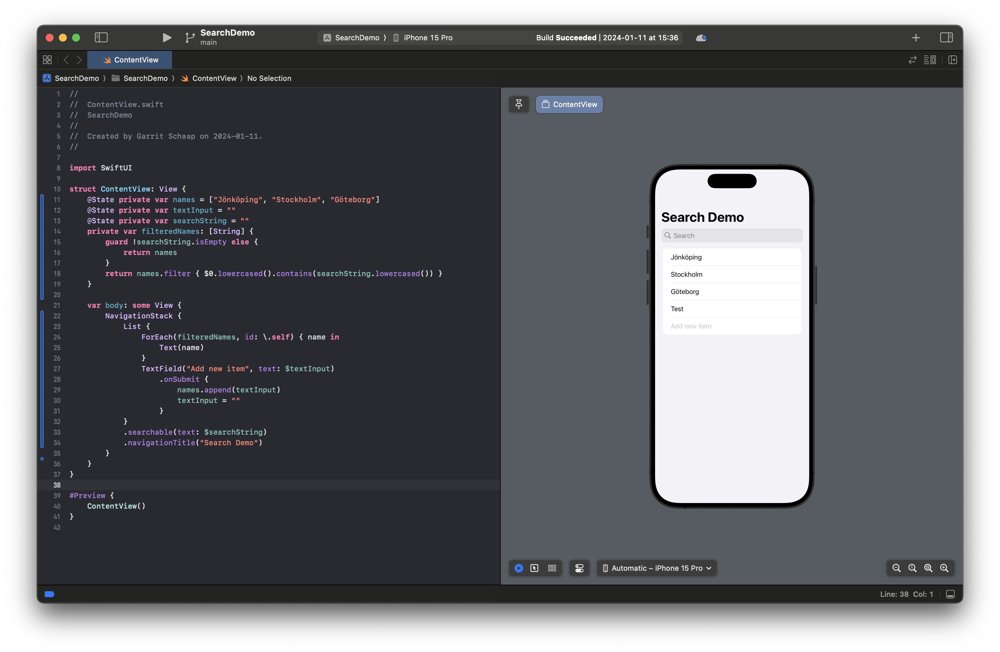
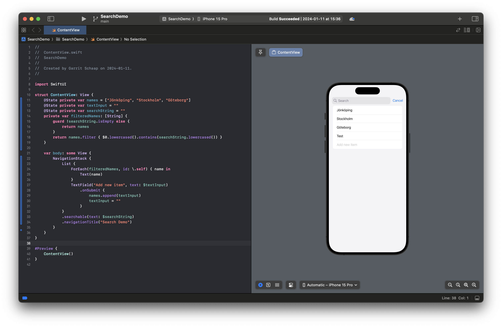
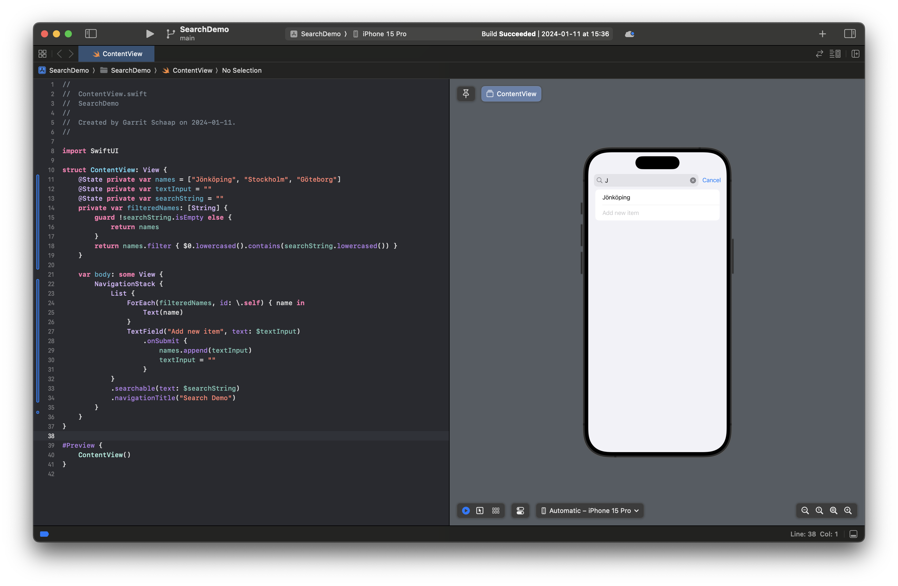

# Example: Using a search bar

In this example, we will use a search bar on a list to filter the list.

## Initial Setup

First we create an app that contains a list of strings. For that, we create an array with some example strings. We will use Swedish cities for now. We make it a `@State` var because we want to add more cities to it in the next step.

We use a `NavigationStack` to display a title and later add the search bar to it. Inside we use `List` and `ForEach` to display the cities.

```Swift
@State private var names = ["Jönköping", "Stockholm", "Göteborg"]

var body: some View {
    NavigationStack {
        List {
            ForEach(names, id: \.self) { name in
                Text(name)
            }
        }
        .navigationTitle("Search Demo")
    }
}
```

## Add a TextField

Next, we want to add a `TextField` to add new items to the list. In order to do that, we need to create an additional `@State` var called `textInput`. After the `ForEach` we add the `TextField` and add the `onSubmit` modifier to add a new item on pressing _enter_.

```Swift
@State private var names = ["Jönköping", "Stockholm", "Göteborg"]
@State private var textInput = ""

var body: some View {
    NavigationStack {
        List {
            ForEach(names, id: \.self) { name in
                Text(name)
            }
            TextField("Add new item", text: $textInput)
                .onSubmit {
                    names.append(textInput)
                    textInput = ""
                }
        }
        .navigationTitle("Search Demo")
    }
}
```

## Make the list searchable

Lastly, we want to add the search bar. We can do that by using the `searchable` modifier. It will display the search bar automatically under the title of the `NavigationStack`. The `searchable` modifier expects a binding property where it will store the text input in. Similar to the `TextField`.

Now we can use this `searchString` variable to create a filtered list of our city names. We should check that the `searchString` is not empty. We can do that by using a `guard` statement. Here is the working code.

```Swift
@State private var names = ["Jönköping", "Stockholm", "Göteborg"]
@State private var textInput = ""
@State private var searchString = ""
private var filteredNames: [String] {
    guard !searchString.isEmpty else {
        return names
    }
    return names.filter { $0.lowercased().contains(searchString.lowercased()) }
}

var body: some View {
    NavigationStack {
        List {
            ForEach(filteredNames, id: \.self) { name in
                Text(name)
            }
            TextField("Add new item", text: $textInput)
                .onSubmit {
                    names.append(textInput)
                    textInput = ""
                }
        }
        .searchable(text: $searchString)
        .navigationTitle("Search Demo")
    }
}
```




