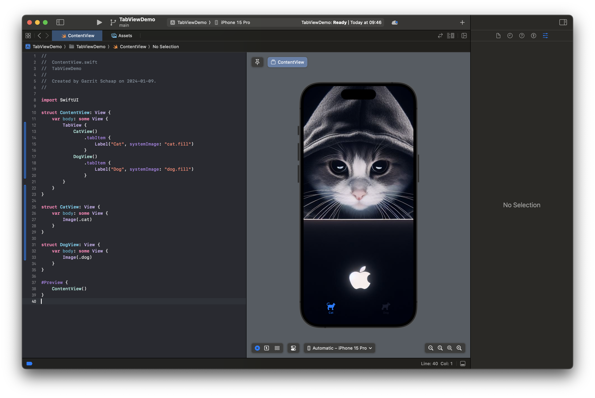
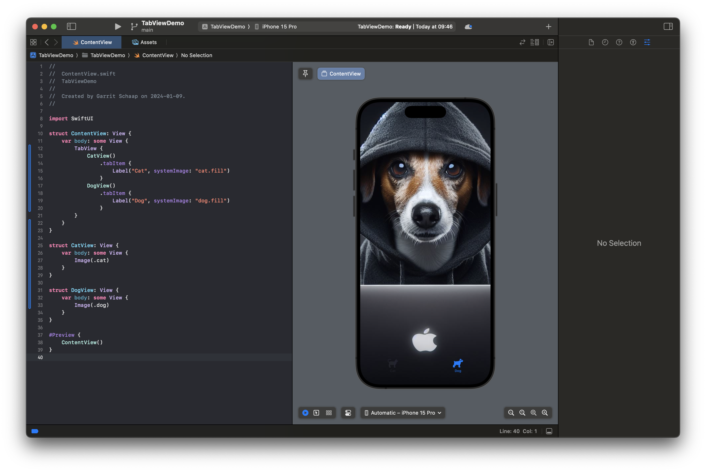

# TabView

With a `TabView` we can build a flat navigation, a navigation that can switch between different screens on the same hierarchical level.

In our example we will build an app to switch between a cat and a dog view. First, we will build the two views we want to switch between. The first view is a `CatView` with a picture of a cat.

```Swift
struct CatView: View {
    var body: some View {
        Image(.cat)
    }
}
```

The second view is a `DogView` with a picture of a dog.

```Swift
struct DogView: View {
    var body: some View {
        Image(.dog)
    }
}
```

Now we build the Navigation. For this, we use the `TabView`. Inside the `TabView`, we create an instance of the views we want to display. Please note that it can be more than two. After the view, we add the `tabItem` modifier and inside its code-block we define the label, with text and icon, that will be displayed in the tabbar. We have to do that for every view.

```Swift
struct ContentView: View {
    var body: some View {
        TabView {
            CatView()
                .tabItem {
                    Label("Cat", systemImage: "cat.fill")
                }
            DogView()
                .tabItem {
                    Label("Dog", systemImage: "dog.fill")
                }
        }
    }
}
```

Here you can see the result.




You can also use a `@State` property to keep track and change the selection. Find out more about it on [Hacking with Swift](https://www.hackingwithswift.com/quick-start/swiftui/how-to-embed-views-in-a-tab-bar-using-tabview).

Now, lets have a look at the hierarchical navigation using `NavigationStack`.
