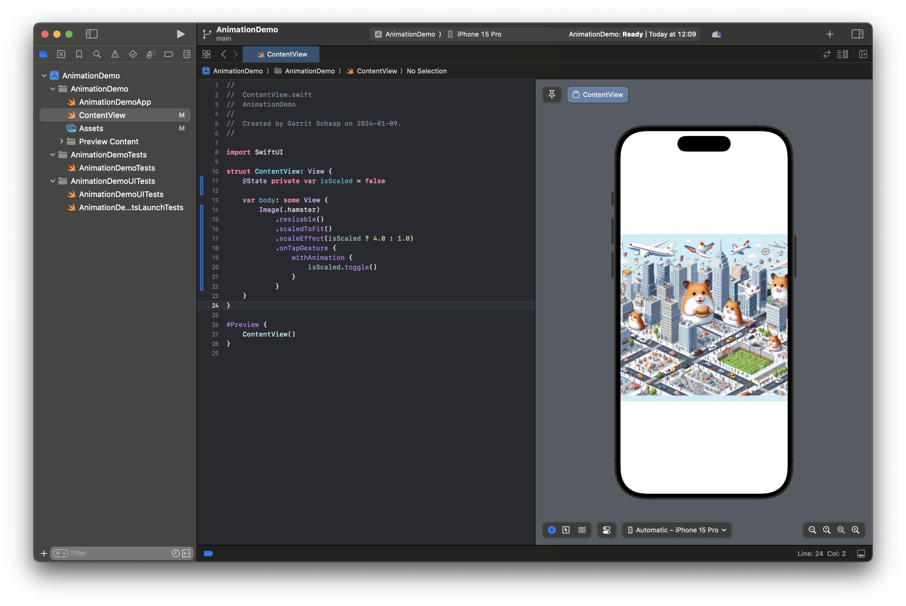
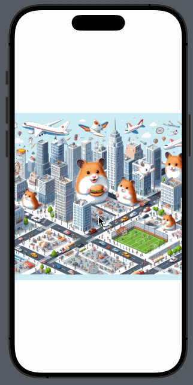

# Animation

SwiftUI offers us a simple way to animate elements on the UI.

The easiest way is to wrap a value that is changed into a `withAnimation`-block. Everytime this value changes, all effects of the change will be animated.

```Swift
withAnimation {
    isScaled.toggle()
}
```

But let's have a look at a complete example. In this example, we have a `bool` value and if it is changed, the scale of an image changes from `scaledToFit` to 4x the size

```Swift
@State private var isScaled = false

var body: some View {
    Image(.hamster)
        .resizable()
        .scaledToFit()
        .scaleEffect(isScaled ? 4.0 : 1.0)
        .onTapGesture {
            withAnimation {
                isScaled.toggle()
            }
        }
}
```




Another way to handle animations in an easy way is by using the `animation` modifier. But it only works with numeric values.

```Swift
@State private var scaleValue = 1.0

var body: some View {
    Image(.hamster)
        .resizable()
        .scaledToFit()
        .scaleEffect(scaleValue)
        .onTapGesture {
            if scaleValue == 1.0 {
                scaleValue = 4.0
            } else {
                scaleValue = 1.0
            }
        }
        .animation(.bouncy, value: scaleValue)
}
```

There are a lot of different ways to animate your views. You can find a workshop from last year about animation in SwiftUI on Canvas.
