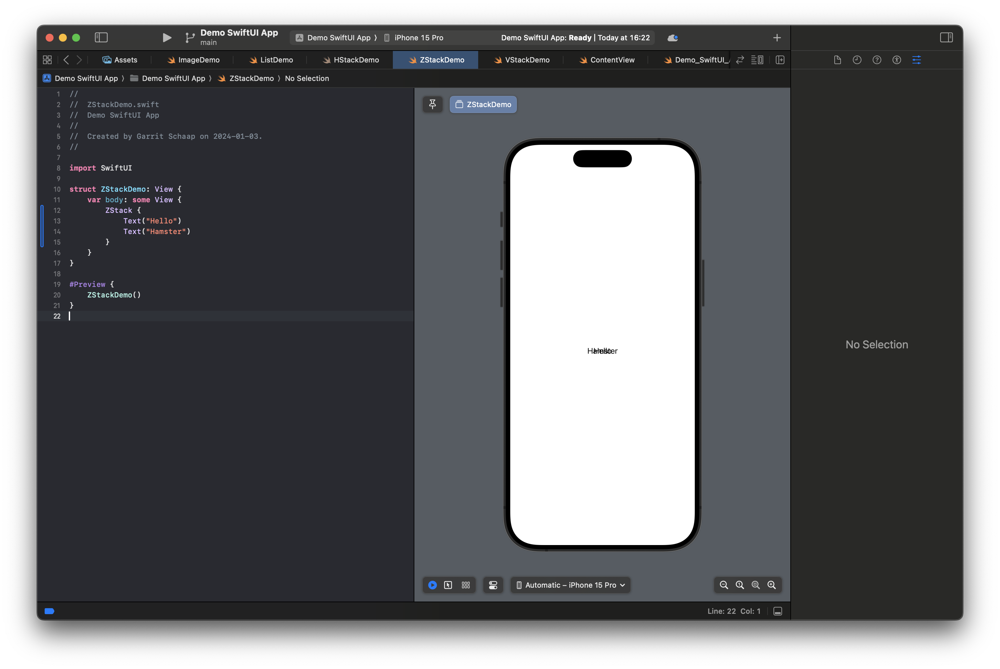

# SwiftUI

SwiftUI is a declarative UI-framework.

## The boilerplate

When you create a new project using Xcode, it will create some example code for you. In this part, we will have a short walkthrough the code. No worries, if you don't understand everything yet. We will explain and cover all of it. And if you have open questions, feel free to ask them on Canvas, during the lecture, or in the labs.

If you open Xcode and create a new project, it will create some starting code inside the `ContentView` file for you that looks like the following:

```Swift
import SwiftUI

struct ContentView: View {
    var body: some View {
        VStack {
            Image(systemName: "globe")
                .imageScale(.large)
                .foregroundStyle(.tint)
            Text("Hello, world!")
        }
        .padding()
    }
}

#Preview {
    ContentView()
}
```

- The first thing that is happening here, is that it imports the SwiftUI framework.
- Next, it defines a `struct` that inherits from `View`. Every view in SwiftUI is a `struct`. That means, it is a value-type and immutable. You don't have a reference to a specific view. In a declarative approach, you don't change views directly. Instead, you define a view for a specific state and if the state changes, the view get re-evaluated and changes according to the changed state.
- The `View` has a `body` property of type `some View` (you can learn more about it in the lecture).
- The `body` property contains what is actually viewed on the Interface. In this case, it is a `VStack` (Vertical Stack), that contains an `Image` and a `Text`. No worries, you will learn more about the different components later on.
- There are also some other functions attached to it, like `.padding()` or `.imageScale(.large)`. These are _modifiers_ and we will cover them soon.

When we look at the preview, we can see a small globe icon and a text under it that says _Hello, world!_. It is vertically stacked (`VStack`), and is an `Image` and a `Text`.

There is also a second Swift file that contains the following code:

```Swift
import SwiftUI

@main
struct Demo_SwiftUI_AppApp: App {
    var body: some Scene {
        WindowGroup {
            ContentView()
        }
    }
}
```

- This file contains the `@main` macro, which defines for the compiler, that this is the entry point of our application.
- The `struct` is inheriting from `App`, which is responsible to setup everything for us to run our app.
- Inside the `body` property, we have a `WindowGroup` which contains the call to the `ContentView` that we discussed earlier. The `WindowGroup` will create the _window_ in which our application will run.

Now that we have covered the basic starting code of our application, let's have a closer look at the declarative approach.

## SwiftUI

The main idea behind a declarative UI framework is, that you describe what should be displayed rather than how it is displayed. How the result is achieved is the responsibility of SwiftUI.

Here is a simple example: "I want to display a list to the user with the following items: SwiftUI, List, Demo". If we translate this to SwiftUI, we can do that by using `Text` elements inside a `List` element. This is the code for our example:

```Swift
List {
  Text("SwiftUI")
  Text("List")
  Text("Demo")
}
```

As you can see, we don't create views, retain their reference, etc. Instead, we describe what we want to see, a list with 3 text elements.

If we now want the first element to be larger and bold, you can use modifiers to achieve that. Again, no worries, we will cover how modifiers work soon. The following code creates a list with 3 text elements and makes the first one larger and bold:

```Swift
List {
  Text("SwiftUI")
    .font(.largeTitle)
    .bold()
  Text("List")
  Text("Demo")
}
```

Now that we have talked about the idea behind declarative UI frameworks, lets move on and learn about the different standard elements we have available.

## SwiftUI elements

### Text

The text element can display a `String` to the user.

```Swift
Text("Hello World!")
```

### Image

The image element can display either an image from your assets, or an icon using SF Symbols. To add an image to your assets, you open the asset catalogue in Xcode, click on the plus and create a new _Image Set_. Now you can give the image asset a name. Next, you can add images in the 3 different resolution (1x, 2x, 3x). That means, if your image should be `200px` by `200px` on the screen, you should have another image with the double (400x400) and another one with the triple resolution (600x600). This is used to display the image in the resolution that the device of the user supports. On the right side you can also select _Single Scale_ to upload a single resultion. The name will be converted into an `enum` value that you can use. In my example, I named the image `Hamster` and can use the enum value `.hamster` to access it.

```Swift
Image(.hamster)
```


As you can see, it fills out the whole screen. We will see in a moment how we can use _modifiers_ to change that.

But besides images, you can also use [SF Symbols](https://developer.apple.com/sf-symbols/). SF Symbols is a large icon library, maintained by Apple with over 5000 icons. You can use these icons for free and they even come with animations.

To use a SF Symbol icon in your code, you use the Image element with the `systemName` parameter as an initializer.

```Swift
Image(systemName: "swift")
```

### Label

A label consists of a text and an image, most likely an icon. You often use SF Symbols here. It can be used inside a button for example. Depending on the context, SwiftUI will choose to display the text, the icon, or both.

```Swift
Label("Edit", image: "pencil")
```

### AsyncImage

With `AsyncImage` you can display an image that is loaded from the internet. It takes a `URL` object as a paremeter, which you can initialize with a `String` for example.

```Swift
AsyncImage(url: URL(string: "https://cataas.com/cat"))
```

Now that we have covered some basic elements, lets move on to a bit more complex layouts.

## Layouting in SwiftUI

In SwiftUI, you have a lot of different layouting views. In this part, we will cover the most common ones.

### List

As you have seen earlier, you can create a list with different elements.

```Swift
List {
    Text("Hello")
    Text("World")
}
```

But how about a list with dynamic elements from an array? No problem. We first have to define our array, outside of the body of the `View` and we can then use the `ForEach` to create a `Text` element for every element in our list. Because `String` is not `Identifiable`, we need to define an `id` for every element in our array. We have different possibilities. In our example, we used `\.self` that defines that the elements value is used. We need to identify the created views for SwiftUI, so it can handle transitions, if the list is updated for example.

```Swift
struct ListDemo: View {
    let elements = ["Hamster", "Cat", "Bat"]

    var body: some View {
        List {
            ForEach(elements, id: \.self) {
                Text($0)
            }
        }
    }
}
```

Notice that we use `$0` to access the parameter, instead, we could also have created a named parameter, like in this example:

```Swift
struct ListDemo: View {
    let elements = ["Hamster", "Cat", "Bat"]

    var body: some View {
        List {
            ForEach(elements, id: \.self) { text in
                Text(text)
            }
        }
    }
}
```


### VStack

A `VStack` is used to vertically stack elements on top of each other.

```Swift
VStack {
    Text("Hello")
    Text("Hamster")
}
```


### HStack

A `HStack` is similar to a `VStack` but stacks elements horizontally instead.

```Swift
HStack {
    Text("Hello")
    Text("Hamster")
}
```


### ZStack

A `ZStack` stacks elements on top of each other, on the z-axis. Not the most useful example, I know 🙃.

```Swift
ZStack {
    Text("Hello")
    Text("Hamster")
}
```



## SwiftUI modifiers

Modifiers are used in SwiftUI to modify the look and behavior of SwiftUI elements. They can be used to add _padding_ around an element, set a _background color_ of an element, change the _font_ that is used in a `Text` element, or can be used to _resize_ an `Image`. We will have a look at the most common ones.

Modifiers bubble down the view tree... (WRITE MORE HERE)

Please keep in mind that the position of the modifier can make a large difference how it modifies your views.

### General modifiers

Background (color, behind)
Overlay
Padding
Frame

```Swift
Text("Hello Hamster!")
    .background(.orange)
```


```Swift
Text("Hello Hamster!")
    .foreground(.red)
```


```Swift
Text("Hello Hamster!")
    .background(.orange)
    .foregroundStyle(.white)
```


```Swift
Text("Hello Hamster!")
    .padding()
    .background(.orange)
    .foregroundStyle(.white)
```


### The order of the modifier is important

```Swift
Text("Hello Hamster!")
    .background(.orange)
    .foregroundStyle(.white)
    .padding()
```


### Modifiers for texts

```Swift
Text("Hello Hamster!")
    .font(.largeTitle)
    .italic()
    .bold()
```


### Modifiers for images

If you remember our example from earlier with the hamster in space. The image was covering the whole screen. If we want to make an image fit into the screen, we first have to make it `.resizable()` and then we can for example use `.scaledToFit()` to make sure, that it will not be larger than our screen.

```Swift
Image(.hamster)
    .resizable()
    .scaledToFit()
```


You see in this example that we have to use two modifiers in a specific order, to get the desired result.

### Control modifiers

```Swift
List {
    Text("Hello")
        .swipeActions {
            Button(action: {}) {
                Label("Delete", systemImage: "trash")
            }
        }
    Text("World")
}
```


Let's move on to State in SwiftUI

## Additional resources

You can find more material here:

- [SwiftUI Documentation on Apple Developer](https://developer.apple.com/documentation/swiftui)
- [Introducing SwiftUI on Apple Developer](https://developer.apple.com/tutorials/swiftui)
- [Learning SwiftUI on Apple Developer](https://developer.apple.com/tutorials/swiftui-concepts)
- [SwiftUI Sample Apps on Apple Developer](https://developer.apple.com/tutorials/sample-apps)
- [SwiftUI in 100 Days on Hacking with Swift](https://www.hackingwithswift.com/100/swiftui)
